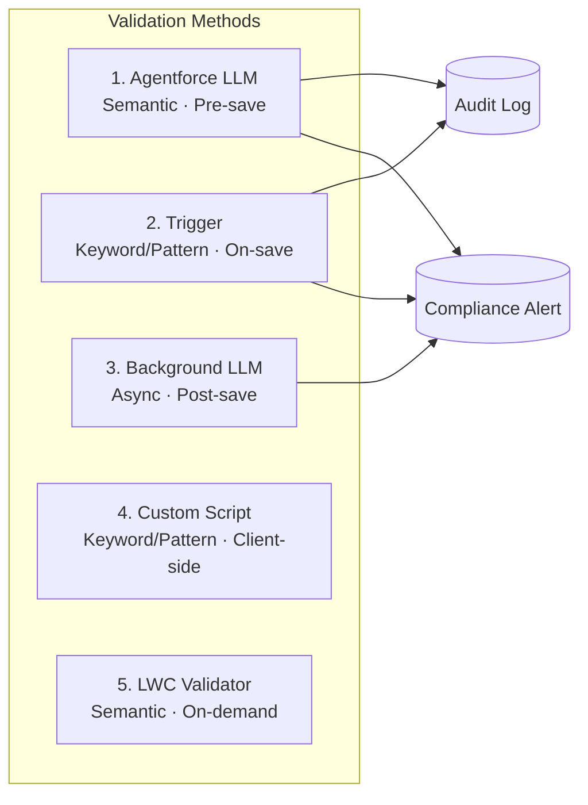

# LSC4CE Compliance Agent

**Salesforce Life Sciences Cloud — 5-Method Compliance Validation Framework**

A defense-in-depth compliance validation solution for pharmaceutical field representative visit notes. Validates text against organizational SOPs using five independent methods — a failure in one layer does not compromise the others.

---

## Architecture



| # | Method | When | Online? | Blocks Save? | Validation Type |
|---|--------|------|:---:|:---:|---|
| 1 | Agentforce LLM | Agent conversation | Yes | Yes | Semantic (Einstein GPT + RAG) |
| 2 | Keyword/Pattern Trigger | Record save | No | Yes (if Block) | Deterministic |
| 3 | Background LLM + AppAlert | After save (async) | Yes | No (alerts only) | Semantic (Einstein GPT + RAG) |
| 4 | Custom Script (iPad) | Field change | No | Yes (if Block) | Deterministic |
| 5 | LWC Compliance Tab | Button click | Yes | No (advisory) | Semantic (Einstein GPT + RAG) |

---

## Prerequisites

- Salesforce org with **Life Sciences Cloud** package installed (provides `ProviderVisit` object)
- **Einstein Generative AI** enabled (for Methods 1, 3, 5)
- **Territory2** model configured and active (for Method 3 AppAlert routing)
- **Salesforce CLI** (`sf`) v2.x installed — [Install guide](https://developer.salesforce.com/tools/salesforcecli)
- Authenticated to your target org: `sf org login web --alias my-org`

---

## Quick Start

### 1. Clone

```bash
git clone https://github.com/nilpal2025-sfdc/lsc4ce-compliance-agent.git
cd lsc4ce-compliance-agent
```

### 2. Deploy

```bash
# Full deployment (includes Agentforce)
./scripts/deploy.sh my-org

# Without Agentforce (if no Einstein Agent license)
./scripts/deploy.sh my-org --skip-agentforce
```

The script deploys in dependency order: Objects → Classes → Triggers → Flows → Permission Sets → LWCs → Agentforce.

### 3. Load Sample Rules

```bash
sf apex run --file data/sample-rules.apex --target-org my-org
sf apex run --file data/create-agentforce-marker-rule.apex --target-org my-org
```

### 4. Post-Deployment Configuration

Manual steps required for full functionality — see **[docs/CONFIGURATION.md](docs/CONFIGURATION.md)**:

1. Create Data Library and upload compliance SOPs
2. Create `Compliance_Check` Prompt Template
3. Update Flow Retriever ID
4. Activate Background Validation Flow
5. Configure DbSchema for AppAlerts (mobile)
6. Configure Custom Script in Visit Engagement
7. Add LWC to Visit record page

### 5. Verify

```bash
./scripts/verify-deployment.sh my-org
```

---

## What Gets Deployed

| Type | Components |
|------|-----------|
| Custom Objects | `Compliance_Rule__c`, `Compliance_Alert__c`, `Compliance_Audit_Log__c` |
| Platform Event | `Compliance_Alert_Event__e` |
| Apex Classes | 8 classes + 6 test classes (80%+ coverage) |
| Triggers | `ProviderVisitComplianceTrigger`, `AccountComplianceTrigger` |
| Flows | `Visit_Logging_Compliance_Check`, `ProviderVisit_Compliance_Background_Validation`, `Visit_Note_Processor_Simple` |
| LWCs | `complianceValidationScript`, `lscMobileInline_ComplianceValidator` |
| Permission Set | `Compliance_Framework_Admin` |
| Agentforce | `Compliant_Visit_Logging` bot + planner bundle, `PostCallVisitNotes` plugin |

---

## Testing

```bash
# Run all compliance tests
sf apex run test \
  --tests ComplianceRuleEngineTest,ComplianceFlowServiceTest,ComplianceValidationServiceTest,ComplianceValidationControllerTest,ComplianceScriptServiceTest,ComplianceReviewParserTest \
  --target-org my-org \
  --code-coverage \
  --result-format human

# Run all local tests
sf apex run test --test-level RunLocalTests --target-org my-org --wait 10
```

### Manual Validation

**Method 2 (quickest to test — no LLM needed):**
1. Create a ProviderVisit record
2. Set `NextProviderVisitObjective` to "Discussed off-label use of the product"
3. Save → Should be **blocked** with an error message showing the rule violation
4. Check: `Compliance_Alert__c` record created, `Compliance_Audit_Log__c` record created

---

## Monitoring

```sql
-- Violations in last 24 hours
SELECT Id, Alert_Name__c, Severity__c, Status__c, Alert_Date__c
FROM Compliance_Alert__c
WHERE Alert_Date__c = LAST_N_DAYS:1
ORDER BY Alert_Date__c DESC

-- Validation pass rate (last 7 days)
SELECT Validation_Result__c, COUNT(Id)
FROM Compliance_Audit_Log__c
WHERE Timestamp__c = LAST_N_DAYS:7
GROUP BY Validation_Result__c

-- Unresolved critical alerts
SELECT Id, Alert_Name__c, Alert_Date__c, User__r.Name
FROM Compliance_Alert__c
WHERE Status__c = 'Open' AND Severity__c = 'Critical'
```

---

## Troubleshooting

| Symptom | Cause | Fix |
|---------|-------|-----|
| Rule not triggering | `Is_Active__c = false` or wrong Target_Object/Field | Verify rule config |
| Save not blocked | Action set to `Warn`/`Log` | Change to `Block` |
| No audit logs | DML limits in bulk ops | Check `flushAuditLogs()` called |
| Flow errors | Flow deactivated or prompt template missing | Check FlowDefinitionView |
| AppAlert not on iPad | DbSchema not configured | Add AppAlert to mobile cache |
| Custom script: "No rules" | Rules not synced to device | Check mobile sync includes `Compliance_Rule__c` |

---

## Documentation

| Document | Description |
|----------|-------------|
| [IMPLEMENTATION-GUIDE.md](docs/IMPLEMENTATION-GUIDE.md) | Complete technical reference (2,100+ lines) |
| [ARCHITECTURE.md](docs/ARCHITECTURE.md) | Mermaid diagrams, design decisions, data model |
| [CONFIGURATION.md](docs/CONFIGURATION.md) | Post-deployment manual configuration steps |

---

## Important Notes

- **This is a demonstration/prototype.** See disclaimers in the Implementation Guide before using in regulated environments.
- The `AccountComplianceTrigger` validates `Account.Description` as a demo/proxy — useful for testing without LSC package.
- The Background Validation Flow deploys in **Draft** status and must be manually activated.
- The RAG Retriever ID in the compliance flow is org-specific and must be replaced after Data Library setup.
- `ENABLE_FLOW_VALIDATION` in `ComplianceRuleEngine` is set to `false` — LLM is disabled in the synchronous trigger path to prevent mobile sync timeouts.

---

## License

MIT — See [LICENSE](LICENSE)
