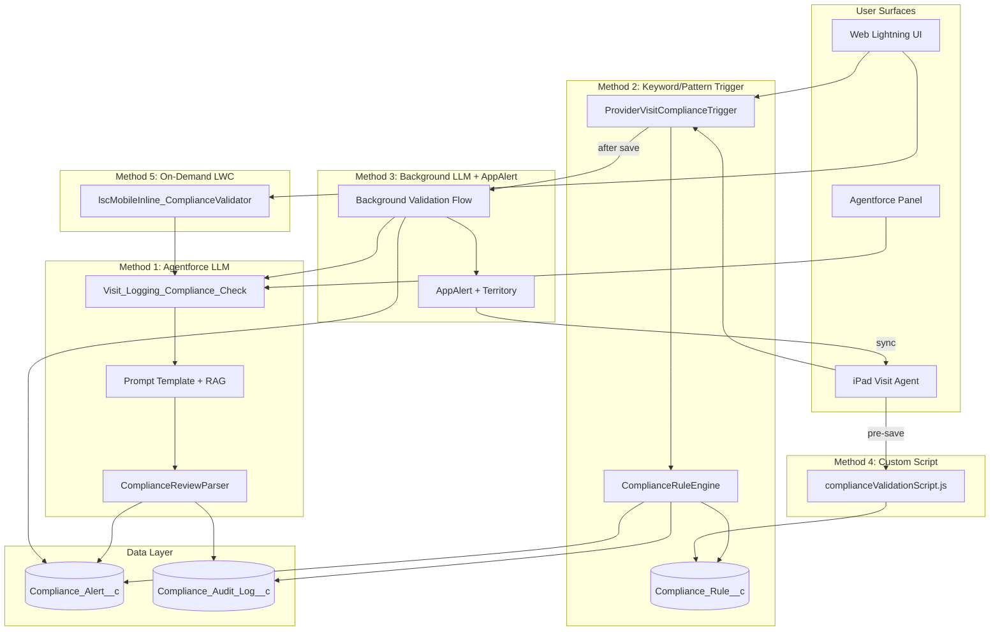
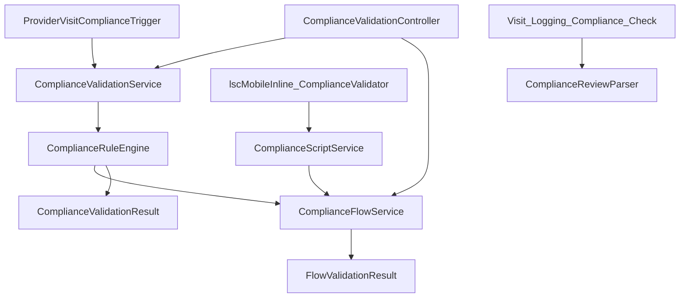
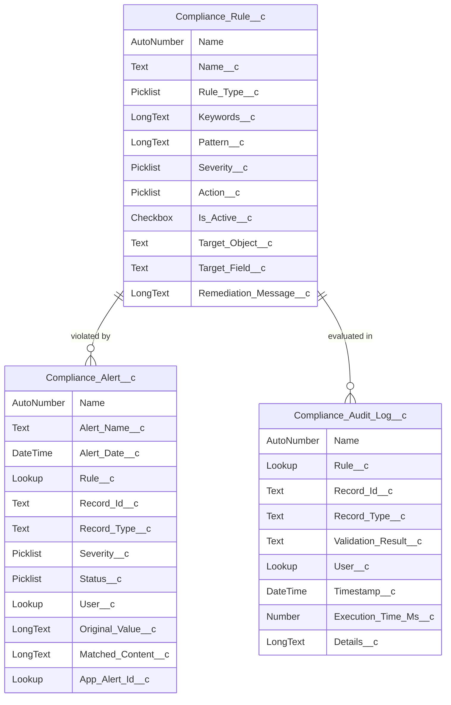
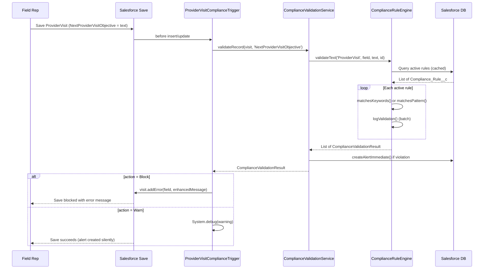
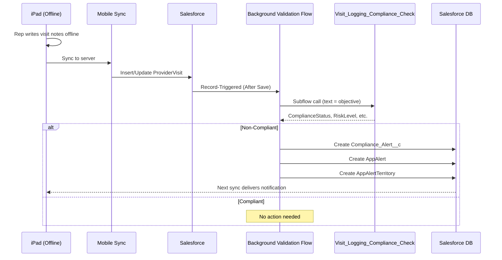

# Architecture

## High-Level Architecture

## Validation Method Comparison

| # | Method | Timing | Validation Type | Blocks Save? | Network Required? |
|---|--------|--------|-----------------|:---:|:---:|
| 1 | Agentforce LLM | Pre-save (conversational) | Semantic (LLM + RAG) | Yes (agent refuses) | Yes |
| 2 | Keyword/Pattern Trigger | On save (synchronous) | Deterministic | Yes (if Block) | No |
| 3 | Background LLM + AppAlert | Post-save (async) | Semantic (LLM + RAG) | No (advisory) | Yes |
| 4 | Custom Script | Pre-save (client-side) | Deterministic | Yes (if Block) | No |
| 5 | LWC Compliance Tab | On-demand (button) | Semantic (LLM + RAG) | No (advisory) | Yes |

## Class Dependency Graph

## Data Model

## Method 2 Sequence (Trigger — Primary Real-Time Validation)

## Method 3 Sequence (Background LLM + AppAlert)

## Key Design Decisions

| Decision | Rationale |
|----------|-----------|
| LLM disabled in sync trigger path | LLM calls (2-5s) would cause mobile sync timeouts for batch operations |
| Fail-open on errors | A broken compliance system must not halt all field operations |
| Rule caching per-transaction | Prevents repeated SOQL during bulk saves (e.g., 200 visits syncing) |
| Batch audit log flushing | Single DML for all audit logs prevents governor limit issues |
| Temp ID pattern for before-insert | Alerts need record IDs; before-insert records have none yet |
| Exact-match "Compliant" only | Any ambiguous LLM response (blank, partial, etc.) is treated as non-compliant |
