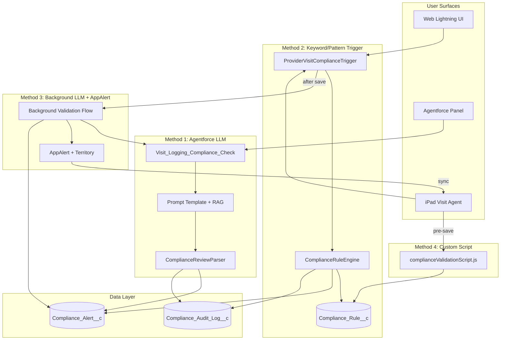
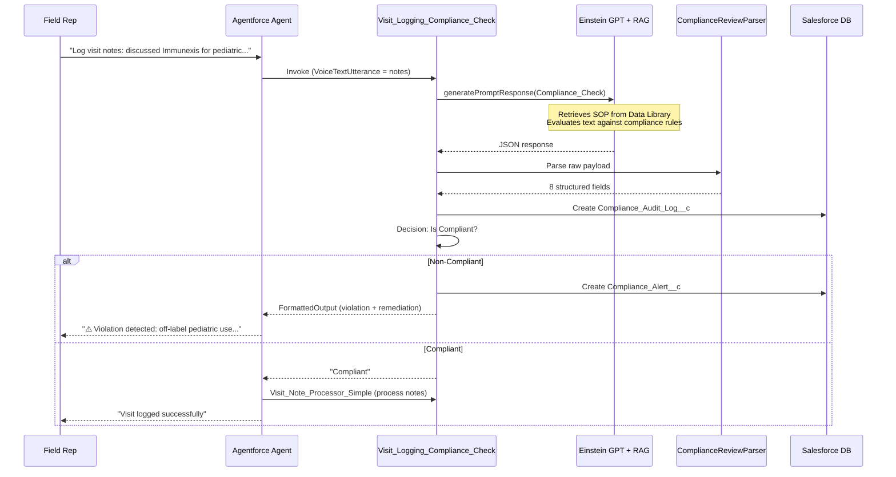
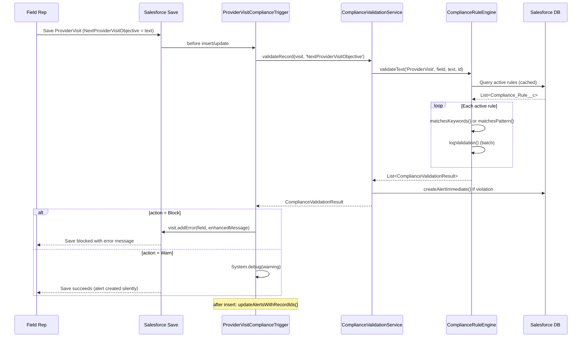
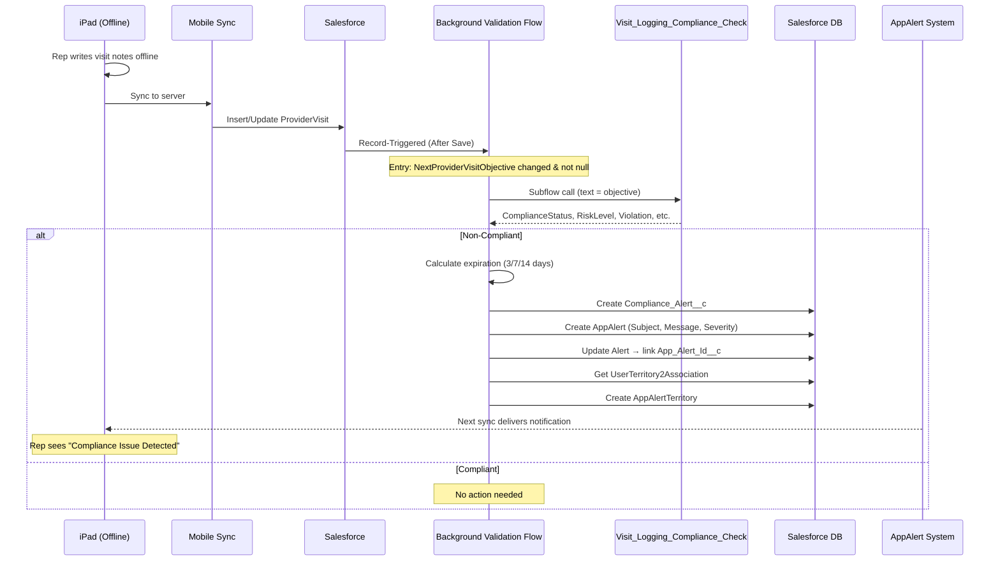
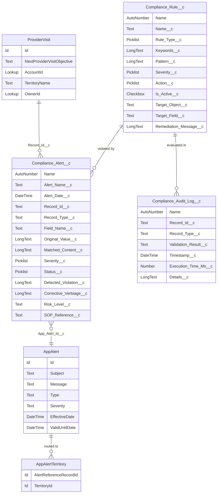
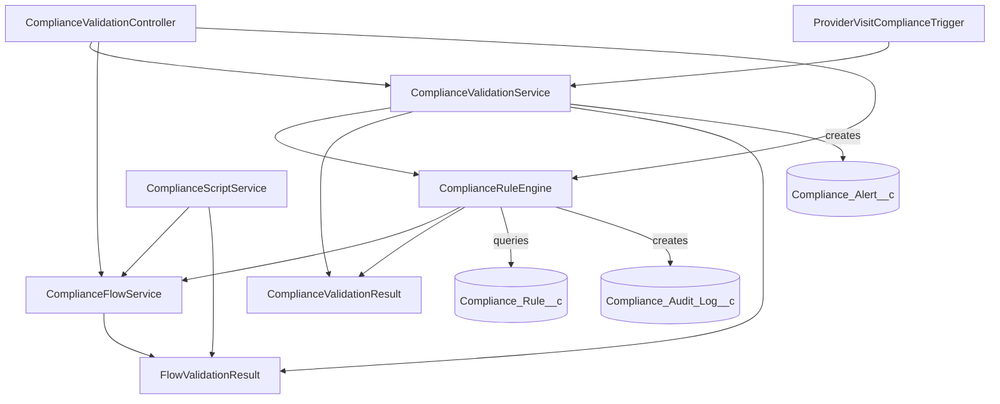
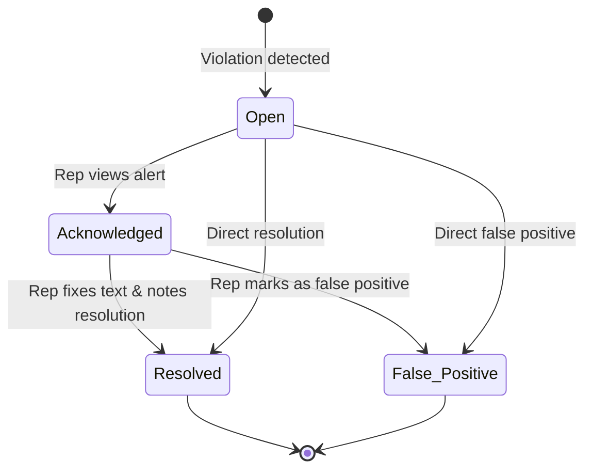
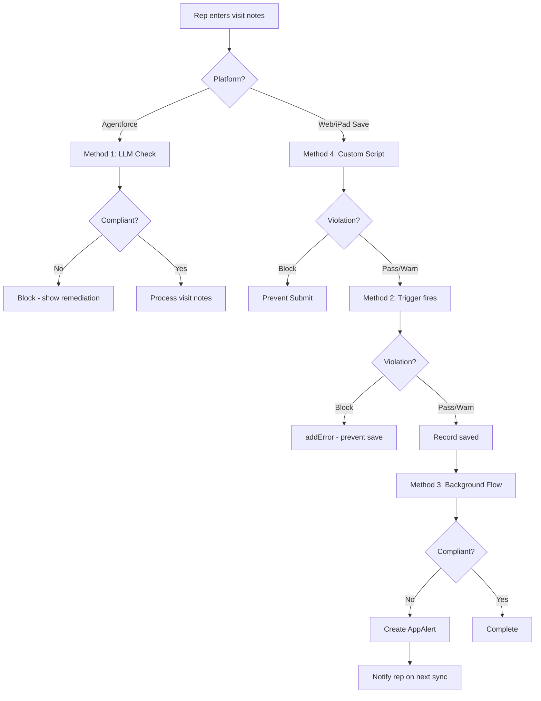

# Compliance Validation Framework — Complete Implementation Guide

## Salesforce Life Sciences Cloud (mpharmademo) — API v66.0

**Document Classification:** Internal Technical Implementation Reference
**Version:** 1.0
**Date:** May 6, 2026
**Author:** Nilotpal Paul, Director of Product Management, Agentforce Life Sciences Cloud
**Audience:** Implementation Partners, Internal Engineering, Solutions Architects
**Target Org:** mpharmademo (my-org)

---

> **Important Disclaimers and Known Limitations**
>
> This document describes a **demonstration/prototype implementation** deployed in a demo org. It is NOT validated for regulated production use. Before distributing to partners or deploying in a regulated environment, the following gaps must be addressed:
>
> - **21 CFR Part 11 claims are aspirational, not enforced.** The current permission set grants Delete access on `Compliance_Audit_Log__c`, contradicting audit immutability claims. A before-delete trigger and segmented permission sets (Admin/User/Manager/Auditor) are required before regulatory claims are valid.
> - **Agentforce action ordering is non-deterministic.** The compliance-first orchestration instruction is a strong hint to the LLM, not a programmatic guarantee. The trigger-based keyword validation (Method 2) is the true backstop.
> - **Missing deployable components.** The `ComplianceReviewParser` Apex class and `Compliance_Check` Prompt Template are not included in the SFDX project source. Partners must create these manually per Section 26.
> - **Background Validation Flow is in Draft status.** Method 3 is non-functional until manually activated post-deployment.
> - **Regex engine divergence.** Apex (Java regex) and the custom script (JavaScript regex) are not fully compatible. Complex patterns using lookbehinds or possessive quantifiers will behave differently across platforms.
> - **RAG Retriever ID is org-specific.** The hardcoded constant `File_LSC_Field_Sales_Compliance_Library_1Cx_aEre37a6895` must be replaced per-org after Data Library setup.
> - **No data retention strategy.** Audit logs grow at ~20,000 records/day for a 500-rep org with no archival mechanism in place.
> - **No outbound integration.** Compliance alerts do not currently feed external QMS systems (Veeva Vault, Trackwise, etc.). Integration architecture is planned for v2.0.
> - **Feature flags require code deployment.** `ENABLE_FLOW_VALIDATION` is a static Apex constant, not a runtime-configurable Custom Metadata setting.
>
> For a full review of architectural gaps and remediation recommendations, see the Solution Architect Review (available on request).

---

## Table of Contents

- [Part I: Architecture Overview](#part-i-architecture-overview)
  - [1. Solution Summary](#1-solution-summary)
  - [2. High-Level Architecture](#2-high-level-architecture)
  - [3. Key Design Decisions](#3-key-design-decisions)
- [Part II: Method 1 — Agentforce LLM Validation](#part-ii-method-1--agentforce-llm-validation)
  - [4. Method 1 Overview](#4-method-1-overview)
  - [5. Agentforce Agent Configuration](#5-agentforce-agent-configuration)
  - [6. Visit_Logging_Compliance_Check Flow](#6-visit_logging_compliance_check-flow)
  - [7. Apex Integration Layer for Method 1](#7-apex-integration-layer-for-method-1)
- [Part III: Method 2 — Keyword/Pattern Matching](#part-iii-method-2--keywordpattern-matching)
  - [8. Method 2 Overview](#8-method-2-overview)
  - [9. ComplianceRuleEngine — Core Engine](#9-complianceruleengine--core-engine)
  - [10. Triggers](#10-triggers)
  - [11. ComplianceValidationService — Orchestration](#11-compliancevalidationservice--orchestration)
- [Part IV: Method 3 — Background LLM with AppAlerts](#part-iv-method-3--background-llm-with-appalerts)
  - [12. Method 3 Overview](#12-method-3-overview)
  - [13. ProviderVisit_Compliance_Background_Validation Flow](#13-providervisit_compliance_background_validation-flow)
  - [14. AppAlert Mobile Delivery](#14-appalert-mobile-delivery)
- [Part V: Method 4 — Custom Script (Offline iPad)](#part-v-method-4--custom-script-offline-ipad)
  - [15. complianceValidationScript.js](#15-compliancevalidationscriptjs)
  - [16. Custom Script Deployment](#16-custom-script-deployment)
- [Part V-B: LWC Compliance Validator — Visit Record Page](#part-v-b-lwc-compliance-validator--visit-record-page-compliance-tab)
  - [17. lscMobileInline_ComplianceValidator](#17-lscmobileinline_compliancevalidator)
- [Part VI: Data Model](#part-vi-data-model)
  - [17. Compliance_Rule__c](#17-compliance_rule__c)
  - [18. Compliance_Alert__c](#18-compliance_alert__c)
  - [19. Compliance_Audit_Log__c](#19-compliance_audit_log__c)
  - [20. Compliance_Alert_Event__e](#20-compliance_alert_event__e)
- [Part VII: Security & Permissions](#part-vii-security--permissions)
  - [21. Permission Set Configuration](#21-permission-set-configuration)
- [Part VIII: Architecture Diagrams](#part-viii-architecture-diagrams)
  - [22. Mermaid Diagrams](#22-mermaid-diagrams)
- [Part IX: Deployment & Operations](#part-ix-deployment--operations)
  - [23. Deployment Guide](#23-deployment-guide)
  - [24. Testing](#24-testing)
  - [25. Monitoring & Troubleshooting](#25-monitoring--troubleshooting)
- [Part X: Replication Guide](#part-x-replication-guide)
  - [26. Implementing in Another Org](#26-implementing-in-another-org)
- [Appendices](#appendices)

---

## Glossary

| Term | Definition |
|------|-----------|
| **AppAlert** | Standard Salesforce object for delivering in-app notifications to mobile users |
| **AppAlertTerritory** | Junction object routing AppAlerts to specific territories for mobile sync |
| **21 CFR Part 11** | FDA regulation governing electronic records and signatures |
| **ALCOA+** | Data integrity principles: Attributable, Legible, Contemporaneous, Original, Accurate + Complete, Consistent, Enduring, Available |
| **DbSchema** | LSC mobile metadata cache configuration that controls which objects sync to iPad |
| **MVP** | Mobile Voice Platform — on-device LLM/SLM for offline AI capabilities |
| **RAG** | Retrieval-Augmented Generation — LLM technique grounding responses in source documents |
| **Visit Agent** | LSC mobile app on iPad used by field representatives |
| **Custom Script** | JavaScript executed within Visit Engagement on the LSC mobile app |
| **ProviderVisit** | Standard LSC object representing a field rep's visit to an HCP |

---

## Platform Applicability Matrix

| Method | iPad Offline | iPad Online | Web (Lightning) | Agentforce Panel |
|--------|:---:|:---:|:---:|:---:|
| **1: Agentforce LLM** | — | Yes | Yes | Yes |
| **2: Keyword/Pattern (Trigger)** | Yes (via sync) | Yes | Yes | — |
| **3: Background LLM + AppAlert** | Receives alert | Yes | Yes | — |
| **4: Custom Script** | Yes | Yes | Yes | — |
| **5: Compliance Tab LWC** | — | Yes | Yes | — |

---

# Part I: Architecture Overview

## 1. Solution Summary

The Compliance Validation Framework implements **defense-in-depth** for pharmaceutical visit note compliance. Four independent validation layers operate at different points in the record lifecycle. A failure in one layer does not compromise the others.

| Layer | Method | Timing | Validation Type | On Failure |
|-------|--------|--------|-----------------|------------|
| 1 | Agentforce LLM | Pre-save (conversational) | Semantic (Einstein GPT + RAG) | Fail-open (allow save) |
| 2 | Keyword/Pattern Trigger | On save (synchronous) | Deterministic (keyword/regex) | Block save if action=Block |
| 3 | Background LLM + AppAlert | Post-save (asynchronous) | Semantic (Einstein GPT + RAG) | Fail-open (no alert created) |
| 4 | Custom Script | Pre-save (client-side) | Deterministic (keyword/regex) | Block submit if action=Block |
| 5 | Compliance Tab LWC | On-demand (user-initiated) | Semantic (Einstein GPT + RAG) | Advisory only (does not block) |

**Primary validated field:** `ProviderVisit.NextProviderVisitObjective` (standard LSC field)
**Secondary validated fields:** `PreProviderVisitNotes` (custom script only), `Account.Description` (demo trigger)

---

## 2. High-Level Architecture

### Component Inventory

| Type | Name | Status | Purpose |
|------|------|--------|---------|
| **Custom Object** | Compliance_Rule__c | Deployed | Rule definitions |
| **Custom Object** | Compliance_Alert__c | Deployed | Violation tracking |
| **Custom Object** | Compliance_Audit_Log__c | Deployed | Audit trail |
| **Platform Event** | Compliance_Alert_Event__e | Deployed | Real-time event alerting |
| **Apex Class** | ComplianceRuleEngine | Deployed | Core validation engine |
| **Apex Class** | ComplianceFlowService | Deployed | Flow invocation layer |
| **Apex Class** | ComplianceValidationService | Deployed | Orchestration + alert creation |
| **Apex Class** | ComplianceValidationController | Deployed | AuraEnabled controller |
| **Apex Class** | ComplianceScriptService | Deployed | Custom script interface |
| **Apex Class** | ComplianceValidationResult | Deployed | Result wrapper |
| **Apex Class** | FlowValidationResult | Deployed | LLM flow output wrapper |
| **Trigger** | ProviderVisitComplianceTrigger | Deployed | Visit validation |
| **Trigger** | AccountComplianceTrigger | Deployed | Demo trigger |
| **Flow** | Visit_Logging_Compliance_Check | Active | LLM compliance evaluation |
| **Flow** | ProviderVisit_Compliance_Background_Validation | Draft | Background LLM + AppAlert |
| **Flow** | Visit_Note_Processor_Simple | Active | Voice note processing |
| **LWC** | complianceValidationScript | Deployed | Offline custom script |
| **LWC** | lscMobileInline_ComplianceValidator | Deployed | Compliance tab on Visit record page (on-demand LLM check) |
| **Permission Set** | Compliance_Framework_Admin | Deployed | Admin access |

---

## 3. Key Design Decisions

### 3.1 LLM Disabled in Synchronous Trigger Path

```apex
private static final Boolean ENABLE_FLOW_VALIDATION = false;
```

**Why:** LLM calls take 2-5 seconds. When records sync from iPad (batch of 50+), synchronous LLM calls in before-trigger would cause timeouts and mobile sync failures. The trigger path uses only keyword/pattern matching (<50ms).

**Compensating control:** The Background Validation Flow (Method 3) runs LLM asynchronously after save.

### 3.2 Fail-Open on Errors

All validation methods follow fail-open semantics: if the validation system itself errors (Flow unavailable, SOQL exception, etc.), the record save proceeds. This prevents a broken compliance system from halting all field operations.

```apex
// ComplianceFlowService.createErrorResult()
result.isCompliant = true; // Fail-open: don't block on Flow errors
```

### 3.3 Temporary ID Pattern for Before-Insert Alerts

During `before insert`, the record has no Id yet. The framework generates a temporary ID (`'T' + timestamp`), creates the alert with this temp ID, then updates it in `after insert` once the real Id is available.

```apex
private static String generateTempId() {
    return 'T' + String.valueOf(System.now().getTime()).right(17);
}
```

### 3.4 Rule Caching

Active rules are cached per-transaction using a static Map to avoid repeated SOQL queries during bulk operations:

```apex
private static Map<String, List<Compliance_Rule__c>> rulesCache = new Map<String, List<Compliance_Rule__c>>();
```

### 3.5 Batch Audit Log Flushing

Audit logs accumulate in a static list during validation and are inserted in a single DML operation via `flushAuditLogs()`:

```apex
private static List<Compliance_Audit_Log__c> pendingLogs = new List<Compliance_Audit_Log__c>();
```

### 3.6 Exact-Match Compliance Status

Only the exact string "Compliant" (case-insensitive) passes. Any other value — including "Non-Compliant", blank, or null — is treated as non-compliant:

```apex
private static Boolean isCompliantStatus(String status) {
    if (String.isBlank(status)) return false;
    return 'Compliant'.equalsIgnoreCase(status.trim());
}
```

---

# Part II: Method 1 — Agentforce LLM Validation

## 4. Method 1 Overview

**Applicability:** Web (Agentforce panel), iPad (when online via Agentforce)
**Latency:** 2-5 seconds (LLM inference + RAG retrieval)
**Validation type:** Semantic — understands meaning, not just keywords
**Entry points:**
- Agentforce Agent Action (declarative)
- `ComplianceFlowService.invokeComplianceFlow()` (programmatic)
- `ComplianceValidationController.validateObjective()` (layered: rules + LLM)
- `ComplianceScriptService.validateTextForScript()` (custom script bridge)

**How it works:** The Agentforce agent receives voice/text visit notes from the field rep. Before processing the notes into structured visit data, the agent MUST run the compliance check flow. If the text is non-compliant, the agent returns the violation details and corrective guidance. The visit data is never written to the CRM.

---

## 5. Agentforce Agent Configuration

### Agent Definition

- **Agent Name:** Life Sciences Field Sales
- **Type:** Einstein Copilot (Agentforce)
- **Channel:** Agentforce panel (web + mobile when online)

### Topic Configuration

- **Topic Name:** PostCallVisitNotes
- **Description:** Handles post-call visit note capture with compliance validation

### Agent Actions (Ordered)

| Order | Action | Flow | Purpose | Condition |
|-------|--------|------|---------|-----------|
| 1 | Compliance Check | Visit_Logging_Compliance_Check | Validate text for compliance violations | **Always runs first** |
| 2 | Visit Note Processor | Visit_Note_Processor_Simple | Process compliant notes into structured records | Only if Action 1 returns "Compliant" |

### Orchestration Instruction

The agent's orchestration instruction enforces compliance-first ordering:

> "When a field representative provides visit notes, ALWAYS run the Compliance Check action first. Only proceed to process the visit notes into structured data if the compliance check returns 'Compliant'. If non-compliant, return the violation details, SOP reference, and corrective verbiage to the representative. Do NOT write any data to ProviderVisit records until compliance is confirmed."

This declarative ordering means the compliance gate cannot be bypassed by the user — the agent refuses to process non-compliant text.

---

## 6. Visit_Logging_Compliance_Check Flow

**Flow API Name:** `Visit_Logging_Compliance_Check`
**Type:** AutoLaunchedFlow
**Status:** Active
**API Version:** 66.0

### Input Variable

| Variable | Type | Direction | Description |
|----------|------|-----------|-------------|
| `VoiceTextUtterance` | String | Input | The text to validate (visit notes or objective) |

### Flow Execution Sequence

#### Step 1: Generate Prompt Response (LLM Call)

**Element:** `Compliance_Check_for_Voice_Visit_Logging`
**Action Type:** `generatePromptResponse`
**Prompt Template:** `Compliance_Check`

**Input Parameters:**
- `Input:Query` → `{!VoiceTextUtterance}`
- `Input:RetrieverIdOrName` → `File_LSC_Field_Sales_Compliance_Library_1Cx_aEre37a6895`

The RAG retriever points to a Data Library containing the organization's compliance SOPs (e.g., Makana Health Off-Label Prevention SOP). Einstein GPT retrieves relevant SOP sections before evaluating the text.

**Output:** Raw `PromptResponse` string (JSON from LLM)

#### Step 2: Parse Compliance Response (Apex InvocableAction)

**Element:** `Parse_Compliance_Response`
**Action Type:** `apex`
**Apex Class:** `ComplianceReviewParser` (InvocableMethod)

**Input:** `rawPayload` = `{!PromptResponse}`

**Outputs (8 fields):**

| Output Variable | Type | Description | Example |
|-----------------|------|-------------|---------|
| `ComplianceStatus` | String | "Compliant" or "Non-Compliant" | "Non-Compliant" |
| `RiskLevel` | String | Critical / High / Medium / Low | "Critical" |
| `ComplianceAssessment` | String | Detailed assessment narrative | "The text contains off-label..." |
| `DetectedViolation` | String | Specific violation identified | "Discussion of unapproved pediatric use" |
| `SOPReference` | String | Relevant SOP section | "SOP-COMP-001 Section 8.2" |
| `ReproductionOfConcern` | String | Exact text that triggered flag | "for pediatric patients" |
| `RecommendedAction` | String | What the rep should do | "Remove pediatric reference" |
| `CorrectiveVerbiage` | String | Compliant alternative text | "Discussed approved adult indications..." |

#### Step 3: Create Audit Log (Always)

**Element:** `Create_Audit_Log`
**Object:** `Compliance_Audit_Log__c`

| Field | Value |
|-------|-------|
| Record_Type__c | "ProviderVisit" |
| Record_Id__c | "AgentforceCheck" |
| Validation_Result__c | Formula: `IF(ComplianceStatus = "Compliant", "Pass", "Fail")` |
| Timestamp__c | `{!$Flow.CurrentDateTime}` |
| Details__c | Formula combining status, risk, violation, and input text (truncated to 500 chars) |

#### Step 4: Decision — Check Compliance Status

**Element:** `Check_Compliance_Status`
- **Non-Compliant path:** `ComplianceStatus` != "Compliant" → Create Alert
- **Compliant path (default):** → Assign FormattedOutput

#### Step 5: Create Compliance Alert (Non-Compliant Only)

**Element:** `Create_Compliance_Alert`
**Object:** `Compliance_Alert__c`

| Field | Value |
|-------|-------|
| Alert_Name__c | "Agentforce Compliance Violation" |
| Alert_Date__c | `{!$Flow.CurrentDateTime}` |
| Severity__c | `{!RiskLevel}` |
| Status__c | "Open" |
| Record_Type__c | "ProviderVisit" |
| Record_Id__c | "AgentforceCheck" |
| Field_Name__c | "VoiceTextUtterance" |
| Original_Value__c | `{!VoiceTextUtterance}` |
| Detected_Violation__c | `{!DetectedViolation}` |
| Corrective_Verbiage__c | `{!CorrectiveVerbiage}` |
| Risk_Level__c | `{!RiskLevel}` |
| SOP_Reference__c | `{!SOPReference}` |
| Matched_Content__c | `{!ReproductionOfConcern}` |

#### Step 6: Assign Formatted Output

**Element:** `FinalFormattedOutputResult`

Produces an HTML-formatted compliance review summary for display in the Agentforce panel:

```html
<h1>Compliance Review Summary:</h1>
<p><strong>Status</strong>: {ComplianceStatus}</p>
<p><strong>Risk Level</strong>: {RiskLevel}</p>
<h2>Detailed Findings:</h2>
<p><strong>Assessment</strong>: {ComplianceAssessment}</p>
<p><strong>Detected Violation</strong>: {DetectedViolation}</p>
<p><strong>SOP Reference</strong>: {SOPReference}</p>
<p><strong>Reproduction of Concern</strong>: {ReproductionOfConcern}</p>
<h2>Remediation Guidance:</h2>
<p><strong>Recommended Action</strong>: {RecommendedAction}</p>
<p><strong>Corrective Verbiage</strong>: {CorrectiveVerbiage}</p>
```

### All Output Variables

| Variable | Type | isOutput |
|----------|------|----------|
| ComplianceAssessment | String | true |
| ComplianceStatus | String | true |
| CorrectiveVerbiage | String | true |
| DetectedViolation | String | true |
| FinalFormattedOutput | String | true |
| PromptResponse | String | true |
| RecommendedAction | String | true |
| ReproductionOfConcern | String | true |
| RiskLevel | String | true |
| SOPReference | String | true |
| VoiceTextUtterance | String | (input) |

---

## 7. Apex Integration Layer for Method 1

### 7.1 ComplianceFlowService

**File:** `force-app/main/default/classes/ComplianceFlowService.cls`
**Purpose:** Invokes the Visit_Logging_Compliance_Check flow from Apex code

#### Key Methods

```apex
// Check if Flow is deployed and active (cached per-transaction)
public static Boolean isFlowValidationAvailable()

// Invoke the compliance flow with text content
public static FlowValidationResult invokeComplianceFlow(String textContent, String flowName)
```

**Flow Invocation Pattern:**
```apex
Map<String, Object> flowInputs = new Map<String, Object>();
flowInputs.put('VoiceTextUtterance', textContent);
Flow.Interview flowInterview = Flow.Interview.createInterview(flowName, flowInputs);
flowInterview.start();
```

**Output Extraction:** Reads 8 named variables from the Flow interview instance via `flowInterview.getVariableValue()`.

**Critical Safety Logic — `isCompliantStatus()`:**
```apex
// ONLY exact match of "Compliant" passes. Everything else blocks.
private static Boolean isCompliantStatus(String status) {
    if (String.isBlank(status)) return false;
    return 'Compliant'.equalsIgnoreCase(status.trim());
}
```

### 7.2 ComplianceValidationController

**File:** `force-app/main/default/classes/ComplianceValidationController.cls`
**Purpose:** AuraEnabled controller providing layered validation (rules + LLM)

#### Key Methods

```apex
@AuraEnabled
public static Map<String, Object> validateObjective(Id visitId, String objectiveText)
```

**Layered Validation Logic:**
1. Run rules-based validation first (fast, deterministic)
2. If rules return Block → return immediately (no LLM needed)
3. If rules pass → invoke LLM via `ComplianceFlowService.invokeComplianceFlow()`
4. If LLM returns non-compliant → create alert, return violation details
5. If both pass but rules had a Warn → return compliant with warning
6. Otherwise → return compliant

```apex
@AuraEnabled(cacheable=true)
public static Map<String, Object> getVisitObjective(Id visitId)
```

Returns the `NextProviderVisitObjective` from a ProviderVisit for UI display.

### 7.3 ComplianceScriptService

**File:** `force-app/main/default/classes/ComplianceScriptService.cls`
**Purpose:** Simplified interface for Visit Engagement custom scripts

#### Key Methods

```apex
@AuraEnabled
public static Map<String, Object> validateTextForScript(String textContent)
```

Returns a simplified result map compatible with custom script format:
- `title`: Message string
- `status`: "success" or "error"
- `riskLevel`: Risk level (if error)
- `reproductionOfConcern`: Flagged text (if error)

```apex
@AuraEnabled
public static Boolean isValidationAvailable()

@AuraEnabled(cacheable=true)
public static String getObjectiveForVisit(String visitId)
```

### 7.4 FlowValidationResult

**File:** `force-app/main/default/classes/FlowValidationResult.cls`
**Purpose:** Wrapper for LLM flow output

**Fields:**
| Field | Type | Description |
|-------|------|-------------|
| isCompliant | Boolean | Whether text passed validation |
| status | String | "Compliant" or "Non-Compliant" |
| riskLevel | String | Critical/High/Medium/Low |
| assessment | String | Detailed assessment |
| detectedViolation | String | Specific violation |
| sopReference | String | SOP section reference |
| reproductionOfConcern | String | Exact flagged text |
| recommendedAction | String | What rep should do |
| correctiveVerbiage | String | Compliant alternative |

**Key Methods:**
- `getErrorMessage()` — Formats: `"⚠️ [status] ([risk] Risk) | Found: "[text]" | Action: [corrective]"`
- `toJSON()` — Serializes all fields to JSON for audit logging

---

# Part III: Method 2 — Keyword/Pattern Matching

## 8. Method 2 Overview

**Applicability:** All platforms (iPad offline, iPad online, Web)
**Latency:** <50ms per field
**Validation type:** Deterministic — keyword contains and regex pattern matching
**Entry point:** `ProviderVisitComplianceTrigger` (before insert/update)
**Network required:** No (rules sync to device with mobile metadata)

This is the primary real-time validation method. It fires on every ProviderVisit save/insert, is completely deterministic, and works identically online and offline. Rules are stored in Compliance_Rule__c and queried at runtime.

---

## 9. ComplianceRuleEngine — Core Engine

**File:** `force-app/main/default/classes/ComplianceRuleEngine.cls`

### 9.1 Main Entry Point

```apex
public static List<ComplianceValidationResult> validateText(
    String objectType,   // e.g., "ProviderVisit"
    String fieldName,    // e.g., "NextProviderVisitObjective"
    String textValue,    // The actual text content
    Id recordId          // Record ID (null for before insert)
)
```

**Routing logic:**
- If `ENABLE_FLOW_VALIDATION = true` AND flow is available → `validateWithFlow()`
- Otherwise → `validateWithRules()`
- If flow validation throws → falls back to `validateWithRules()` (if `FALLBACK_TO_RULES = true`)

Currently `ENABLE_FLOW_VALIDATION = false`, so all trigger-path validation uses rules.

### 9.2 Rule-Based Validation

```apex
private static List<ComplianceValidationResult> validateWithRules(
    String objectType, String fieldName, String textValue, Id recordId
)
```

**Algorithm:**
1. Query active rules for the given object + field (cached)
2. For each rule:
   - If `Rule_Type__c == 'Keyword_Match'` → call `matchesKeywords()`
   - If `Rule_Type__c == 'Pattern_Match'` → call `matchesPattern()`
3. If violated → create `ComplianceValidationResult` with rule details
4. Log every validation (pass or fail) via `logValidation()`

### 9.3 Rule Querying with Cache

```apex
public static List<Compliance_Rule__c> getActiveRules(String objectType, String fieldName)
```

**SOQL:**
```sql
SELECT Id, Name__c, Description__c, Rule_Type__c, Keywords__c,
       Pattern__c, Severity__c, Action__c, Remediation_Message__c,
       Target_Object__c, Target_Field__c, Is_Active__c
FROM Compliance_Rule__c
WHERE Is_Active__c = true
AND Target_Object__c = :objectType
AND Target_Field__c = :fieldName
ORDER BY Severity__c ASC
LIMIT 200
```

Cache key: `objectType + '|' + fieldName`

### 9.4 Keyword Matching

```apex
private static Boolean matchesKeywords(String text, String keywords)
```

- Splits `keywords` by comma
- Trims each keyword, converts to lowercase
- Checks if `text.toLowerCase().contains(keyword)`
- Returns `true` on first match (any-match semantics)

### 9.5 Pattern Matching

```apex
private static Boolean matchesPattern(String text, String patternString)
```

- Compiles regex via `Pattern.compile(patternString)`
- Uses `Matcher.find()` (not `matches()` — partial match is sufficient)
- Returns `true` if pattern found anywhere in text

### 9.6 Audit Log Batching

```apex
private static void logValidation(Compliance_Rule__c rule, Id recordId, String recordType, String result, Long executionTime, String matchedContent)

public static void flushAuditLogs()
```

Logs are accumulated in `pendingLogs` and flushed in one `Database.insert(pendingLogs, false)` call. This prevents DML limit issues during bulk operations (e.g., syncing 200 visits).

---

## 10. Triggers

### 10.1 ProviderVisitComplianceTrigger

**File:** `force-app/main/default/triggers/ProviderVisitComplianceTrigger.trigger`
**Object:** ProviderVisit
**Events:** before insert, before update, after insert, after update

#### Before Insert/Update Logic

```
For each ProviderVisit in Trigger.new:
  For each field in fieldsToValidate:
    If field has content:
      result = ComplianceValidationService.validateRecord(visit, fieldName)
      If !result.isValid:
        If action == 'Block':
          visit.addError(fieldName, errorMessage)  ← prevents save
        If action == 'Warn':
          System.debug(warning)  ← save proceeds
```

**Fields validated:** `NextProviderVisitObjective` (standard LSC field, no `__c` suffix)

**Error message formatting:**
- Flow-based results: uses `result.message` directly (pre-formatted by `FlowValidationResult.getErrorMessage()`)
- Rule-based results: uses `result.buildEnhancedMessage(50)` which produces:

```
❌ [Rule Name] - [Severity]

Found: "[matched keywords]" in your text

Problem: [First sentence of remediation message]

Text excerpt: "...[50 chars context around match]..."

Action required: [Action sentence from remediation message]
```

#### After Insert Logic

```apex
if (Trigger.isAfter && Trigger.isInsert) {
    ComplianceValidationService.updateAlertsWithRecordIds(Trigger.new);
}
```

Updates any alerts created during before-insert (with temp IDs) to have the actual record ID.

### 10.2 AccountComplianceTrigger

**File:** `force-app/main/default/triggers/AccountComplianceTrigger.trigger`
**Object:** Account
**Purpose:** Demo/proxy trigger (validates `Description` field as if it were visit notes)

Same pattern as ProviderVisitComplianceTrigger but with simplified error handling.

---

## 11. ComplianceValidationService — Orchestration

**File:** `force-app/main/default/classes/ComplianceValidationService.cls`

### 11.1 validateRecord

```apex
public static ComplianceValidationResult validateRecord(SObject record, String fieldName)
```

1. Extracts object type and text value from the SObject
2. Calls `ComplianceRuleEngine.validateText()`
3. Returns first `Block` violation found, or first `Warn` if no blocks, or valid result

### 11.2 createAlertImmediate

```apex
private static String createAlertImmediate(
    Compliance_Rule__c rule, Id recordId, String objectType,
    String fieldName, String originalValue, String matchedContent,
    FlowValidationResult flowResult
)
```

**Key behaviors:**
- If `recordId` is null → generates temp ID via `generateTempId()`
- Queries ProviderVisit for territory and account names (enriched alert naming)
- If `rule` is null (Flow-based validation) → queries for "Agentforce Evaluation" rule as fallback
- Alert name format: `"Compliance Issue - 2026-03-16 14:30 | West Territory | Visit: [id] | Account: Dr. Smith"`
- Severity: from rule if available, otherwise from `flowResult.riskLevel`
- Truncates long fields to fit limits (Original_Value: 32000, Matched_Content: 4000, SOP_Reference: 255)

### 11.3 updateAlertsWithRecordIds

```apex
public static void updateAlertsWithRecordIds(List<SObject> records)
```

Called from `after insert` trigger. Finds alerts with temp IDs (starting with 'T'), matches them to newly-inserted records, and updates `Record_Id__c` with the actual record ID.

### 11.4 Other Public Methods

```apex
// Bulk validation
public static Map<Id, ComplianceValidationResult> validateRecords(List<SObject> records, String fieldName)

// Query open alerts for a record
public static List<Compliance_Alert__c> getOpenAlerts(Id recordId)

// Resolve an alert
public static void resolveAlert(Id alertId, String resolutionNotes)
```

### 11.5 ComplianceValidationResult

**File:** `force-app/main/default/classes/ComplianceValidationResult.cls`

**Fields:**
| Field | Type | AuraEnabled | Description |
|-------|------|-------------|-------------|
| isValid | Boolean | Yes | True if validation passed |
| severity | String | Yes | Critical/High/Medium/Low |
| action | String | Yes | Block/Warn/Log |
| message | String | Yes | Remediation message |
| matchedContent | String | Yes | Content that triggered violation |
| rule | Compliance_Rule__c | Yes | The violated rule |
| originalText | String | Yes | Full text that was validated |
| violations | List\<String\> | Yes | List of violations (Flow-based) |
| flowResult | FlowValidationResult | No | Full Flow result (internal) |
| tempId | String | No | Temporary ID for before-insert |

**Key Method — `buildEnhancedMessage(Integer contextLength)`:**

Constructs a user-friendly error message with:
1. Header: `"❌ [rule name] - [severity]"`
2. Matched content: `"Found: "[keywords]" in your text"`
3. Problem statement (first sentence of remediation)
4. Text excerpt with N characters of context around the match
5. Action required (sentence containing action keywords like "remove", "ensure", "report")

---

# Part IV: Method 3 — Background LLM with AppAlerts

## 12. Method 3 Overview

**Applicability:** iPad (receives AppAlert after sync), Web (after any ProviderVisit save)
**Timing:** Asynchronous — runs after record is saved
**Validation type:** Semantic (same LLM flow as Method 1)
**Purpose:** Safety net — catches violations that keyword rules miss

**Why this exists:** Method 2 (keyword matching) is fast but limited to known terms. Method 3 uses the same LLM evaluation as Method 1 but runs asynchronously after save. This is the primary compliance mechanism for iPad users who submit visit notes offline — the notes sync to the server, the background flow runs the LLM check, and if non-compliant, an AppAlert is delivered to the rep's iPad on next sync.

---

## 13. ProviderVisit_Compliance_Background_Validation Flow

**Flow API Name:** `ProviderVisit_Compliance_Background_Validation`
**Type:** Record-Triggered Flow (After Save)
**Object:** ProviderVisit
**Status:** Draft (ready for activation)
**API Version:** 66.0

### Entry Conditions

| Condition | Operator | Value |
|-----------|----------|-------|
| NextProviderVisitObjective | Is Changed | true |
| NextProviderVisitObjective | Is Null | false |

**Trigger Type:** RecordAfterSave (CreateAndUpdate)

### Flow Elements (11 Steps)

#### Step 1: Decision — Check_Field_Blank

- **Field Has Value:** `$Record.NextProviderVisitObjective` Is Null = false → Continue
- **Field is Blank:** → END (no validation needed)

#### Step 2: Subflow — Validate_Compliance

Calls `Visit_Logging_Compliance_Check` as a subflow:
- **Input:** `VoiceTextUtterance` = `$Record.NextProviderVisitObjective`
- **Outputs stored in variables:**
  - ComplianceStatus → `varComplianceStatus`
  - RiskLevel → `varRiskLevel`
  - DetectedViolation → `varDetectedViolation`
  - CorrectiveVerbiage → `varCorrectiveVerbiage`
  - ComplianceAssessment → `varComplianceAssessment`
  - SOPReference → `varSOPReference`

#### Step 3: Decision — Check_Compliance_Status (Is Compliant)

**Non-Compliant path (ALL conditions must be met):**
- `varComplianceStatus` != "Compliant"
- `varComplianceStatus` != "" (not blank)
- `varDetectedViolation` Is Null = false
- `varRiskLevel` != "" (not blank)

**Compliant path (default):** → END

#### Step 4: Assignment — Calculate_Expiration_Date

**Expiration by risk level:**

| Risk Level | Expiration Days | Rationale |
|------------|----------------|-----------|
| Critical | 3 days | Urgent — rep must act immediately |
| High | 7 days | Important — resolve within a week |
| Medium / Low | 14 days | Awareness — two weeks to review |

**Formulas:**
```
fx_Calculate_Expiration_Days:
IF(varRiskLevel = "Critical", 3, IF(varRiskLevel = "High", 7, 14))

fx_Calculate_Expiration_DateTime:
DATETIMEVALUE(TEXT(TODAY() + varExpirationDays) & " 23:59:59")
```

#### Step 5: Assignment — Build_Alert_Message

```
fx_Build_Message:
{varDetectedViolation} & "\n\nRecommended Action:\n" & {varCorrectiveVerbiage}
```

#### Step 6: Create Records — Compliance_Alert__c

| Field | Value |
|-------|-------|
| Alert_Name__c | `"Compliance Issue - " & TEXT(TODAY())` |
| Status__c | "Open" |
| Severity__c | `{!varRiskLevel}` |
| Alert_Date__c | `{!$Flow.CurrentDateTime}` |
| User__c | `{!$Record.OwnerId}` |
| Record_Id__c | `{!$Record.Id}` |
| Record_Type__c | "ProviderVisit" |
| Field_Name__c | "NextProviderVisitObjective" |
| Original_Value__c | `{!$Record.NextProviderVisitObjective}` |
| Detected_Violation__c | `{!varDetectedViolation}` |
| Corrective_Verbiage__c | `{!varCorrectiveVerbiage}` |
| Risk_Level__c | `{!varRiskLevel}` |
| SOP_Reference__c | `{!varSOPReference}` |

**Output:** `varComplianceAlertId` (the created record ID)

#### Step 7: Create Records — AppAlert

| Field | Value |
|-------|-------|
| Subject | "Compliance Issue Detected" |
| Message | `{!varAlertMessage}` |
| Type | "Notification" |
| DisplayContextType | "Object" |
| DisplayContextName | "ProviderVisit" |
| Severity | `{!varRiskLevel}` |
| EffectiveDate | `{!$Flow.CurrentDateTime}` |
| ValidUntilDate | `{!varExpirationDate}` |

**Output:** `varAppAlertId`

#### Step 8: Update Records — Link_Alert_To_AppAlert

Updates the Compliance_Alert__c record to set `App_Alert_Id__c = varAppAlertId`, linking the two records.

#### Step 9: Get Records — Get_User_Territory

**Object:** `UserTerritory2Association`
**Filters:** `UserId = $Record.OwnerId` AND `IsActive = true`
**Sort:** CreatedDate ASC
**Output:** `varUserTerritory` (first record)

#### Step 10: Decision — Check_Territory_Found

- **Territory Found:** `varUserTerritory` Is Null = false → Create AppAlertTerritory
- **No Territory:** → END

#### Step 11: Create Records — AppAlertTerritory

| Field | Value |
|-------|-------|
| AlertReferenceRecordId | `{!varAppAlertId}` |
| TerritoryId | `{!varUserTerritory.Territory2Id}` |

This routes the AppAlert to the correct territory so it syncs to the rep's iPad.

---

## 14. AppAlert Mobile Delivery

### How AppAlerts Reach the iPad

1. Background Flow creates `AppAlert` + `AppAlertTerritory` records
2. LSC mobile app syncs AppAlerts via `DbSchema_AppAlert` configuration
3. Alert appears in the rep's notification panel on iPad
4. Rep taps alert → sees violation details and corrective verbiage
5. Alert expires after 3/7/14 days based on severity

### Prerequisites

- **DbSchema_AppAlert** must be configured in the org's mobile metadata cache
- **Territory2 model** must be active with user-territory assignments
- **ProviderVisit.OwnerId** must be populated (used to find user's territory)

### Alert Expiration Table

| Risk Level | Days Until Expiry | ValidUntilDate |
|------------|-------------------|----------------|
| Critical | 3 | Today + 3 @ 23:59:59 |
| High | 7 | Today + 7 @ 23:59:59 |
| Medium | 14 | Today + 14 @ 23:59:59 |
| Low | 14 | Today + 14 @ 23:59:59 |

---

# Part V: Method 4 — Custom Script (Offline iPad)

## 15. complianceValidationScript.js

**File:** `force-app/main/default/lwc/complianceValidationScript/complianceValidationScript.js`
**Size:** 448 lines
**Architecture:** IIFE (Immediately Invoked Function Expression)
**Execution context:** Visit Engagement custom script runtime

### Configuration

```javascript
const CONFIG = {
  TARGET_FIELDS: ['NextProviderVisitObjective', 'PreProviderVisitNotes'],
  COMPLIANCE_RULE_OBJECT: 'Compliance_Rule__c',
  MIN_TEXT_LENGTH: 5,
};
```

### Action Gating

The script only validates on specific actions:

```javascript
const shouldValidate = ['Submit', 'Sign', 'runCustomScriptValidations'].includes(actionName);
```

Other actions (Save, Cancel, etc.) skip validation entirely.

### Core Functions

#### loadComplianceRules()

Queries all active Compliance_Rule__c records using the LSC mobile database API:

```javascript
const condition = await new ConditionBuilder_noNs(
  CONFIG.COMPLIANCE_RULE_OBJECT,
  new FieldCondition_noNs('Is_Active__c', '=', true)
).build();
const rules = await db.noNs_query(CONFIG.COMPLIANCE_RULE_OBJECT, condition);
```

This queries the **local on-device database** — works fully offline.

#### getApplicableRules(allRules, objectType, fieldName)

Filters loaded rules by `Target_Object__c` and `Target_Field__c` to get only rules relevant to the current field.

#### validateKeywords(text, keywords)

Client-side implementation mirroring `ComplianceRuleEngine.matchesKeywords()`:
- Splits keywords by comma
- Lowercases both text and keywords
- Returns `{matched: Boolean, matchedTerms: String[]}`

#### validatePattern(text, pattern)

Client-side regex matching mirroring `ComplianceRuleEngine.matchesPattern()`:
- Creates `new RegExp(pattern, 'i')`
- Returns `{matched: Boolean, matchedText: String}`

#### buildErrorMessage(rule, matchedContent, originalText)

Client-side error formatting mirroring `ComplianceValidationResult.buildEnhancedMessage()`:

```
❌ [Rule Name] - [Severity]

Found: "[matched terms]" in your text

Text excerpt: "...[context around match]..."

Action required: [Remediation message]
```

#### getFieldValue(record, fieldName)

Multi-platform field access handling differences between web and mobile contexts:
1. Try `record.stringValue(fieldName)` (mobile API)
2. Try case variations (camelCase, lowercase)
3. Fall back to `parseContextData()` → check root, `ProviderVisit`, `Visit` keys

#### Platform Detection

```javascript
let isWebPlatform = false;
// Detected via contextData field naming patterns
const webFieldName = baseFieldName + '.VisitId';
if (contextData[webFieldName] !== undefined) {
  isWebPlatform = true;
}
```

#### queueAuditLog(rule, fieldValue, validationResult)

Builds an audit log entry for client-side recording:
```javascript
{
  Rule__c: rule.noNs_stringValue('Id'),
  Record_Id__c: record.stringValue('Id'),
  Record_Type__c: 'ProviderVisit',
  Validation_Result__c: 'Fail',
  User__c: user.stringValue('Id'),
  Timestamp__c: new Date().toISOString(),
  Details__c: JSON.stringify({ matched_content, field_value_length, execution_mode })
}
```

### Main Execution Flow

```javascript
async function validateVisit() {
  // 1. Check action name — skip if not Submit/Sign
  // 2. Load all active compliance rules from device DB
  // 3. For each TARGET_FIELD:
  //    a. Get field value (multi-platform)
  //    b. Skip if blank or < MIN_TEXT_LENGTH
  //    c. Get applicable rules for this field
  //    d. For each rule: validate (keyword or pattern)
  //    e. If matched + action=Block → push error result
  //    f. If matched + action=Warn → push warning result
  //    g. Queue audit log
  // 4. Return results array
}
```

### Return Format

```javascript
[
  { title: "❌ Off-Label Detection - Critical\n\nFound: ...", status: "error" },
  { title: "✓ Visit complies with all validation rules", status: "success" }
]
```

- `status: "error"` → blocks Submit/Sign
- `status: "warning"` → shows warning, allows proceed
- `status: "success"` → no issues

---

## 16. Custom Script Deployment

### Where to Configure

1. Navigate to **Setup → Visit Engagement → Custom Scripts**
2. Create or edit a script assignment for the desired Visit Engagement layout
3. Associate the `complianceValidationScript` LWC component
4. Configure it to run on Submit and Sign actions

### Relationship to Other Methods

| Scenario | Custom Script (Method 4) | Trigger (Method 2) | Background Flow (Method 3) |
|----------|:---:|:---:|:---:|
| iPad offline: Submit | Runs (blocks if violation) | Runs on local save (blocks) | Runs after sync to server |
| iPad online: Submit | Runs (blocks if violation) | Runs on save (blocks) | Runs after save |
| Web: Submit | Runs (blocks if violation) | Runs on save (blocks) | Runs after save |

The custom script provides **pre-save client-side validation** using the same rules as the server-side trigger. This gives immediate feedback to the rep before the record even attempts to save, avoiding server round-trips on mobile.

---

# Part V-B: LWC Compliance Validator — Visit Record Page (Compliance Tab)

## 17. lscMobileInline_ComplianceValidator

**File:** `force-app/main/default/lwc/lscMobileInline_ComplianceValidator/`
**Component Label:** Compliance Validator (LMR Inline)
**Placement:** Compliance tab on ProviderVisit record page
**Works on:** Web (Lightning Record Page) + iPad (LSC mobile inline via `mobileHeight` property)
**API Version:** 65.0

### Purpose

This is a **user-initiated, on-demand LLM compliance check** embedded directly in the Visit record UI. Unlike the trigger (automatic on save) or the custom script (automatic on submit), this component lets the rep manually validate their `NextProviderVisitObjective` text at any time — before, during, or after editing — by clicking a button on the Compliance tab.

This provides a "check before you save" experience within the LSC app on both iPad and web, using the full LLM semantic validation (not just keywords).

### How It Works

```
1. Component loads on record page (connectedCallback)
2. Calls getObjectiveForVisit(recordId) → displays current objective text
3. Calls isValidationAvailable() → checks if LLM Flow is active
4. Rep clicks "Validate Compliance" button
5. Calls validateTextForScript(objectiveText) → invokes Visit_Logging_Compliance_Check Flow
6. Displays result: green card (compliant) or red card (non-compliant + risk badge + flagged content)
```

### Component Architecture

```javascript
import { LightningElement, api } from 'lwc';
import validateTextForScript from '@salesforce/apex/ComplianceScriptService.validateTextForScript';
import isValidationAvailable from '@salesforce/apex/ComplianceScriptService.isValidationAvailable';
import getObjectiveForVisit from '@salesforce/apex/ComplianceScriptService.getObjectiveForVisit';
```

**Public API Properties:**
| Property | Type | Description |
|----------|------|-------------|
| `recordId` | String | Visit record ID (injected by Lightning runtime) |
| `objectApiName` | String | Object API name (injected) |
| `mobileHeight` | Integer | Height in pixels for mobile inline rendering |

**Internal State:**
| State | Type | Description |
|-------|------|-------------|
| `objectiveText` | String | Current NextProviderVisitObjective value |
| `objectiveLoaded` | Boolean | Whether objective has been fetched |
| `validationResult` | Object | Result from validateTextForScript |
| `isLoading` | Boolean | Loading spinner state |
| `error` | String | Error message if any |
| `serviceAvailable` | Boolean | Whether LLM Flow is active |

### UI States

| State | Display |
|-------|---------|
| **Loading objective** | Empty (waiting for Apex) |
| **No objective set** | "No Next Visit Objective set on this record." |
| **Service unavailable** | Warning: "LLM compliance validation is not available. Ensure the Visit_Logging_Compliance_Check flow is active." |
| **Ready** | Shows objective text + enabled "Validate Compliance" button |
| **Validating** | "Running LLM compliance check..." |
| **Compliant** | Green card with result title (status = 'success') |
| **Non-Compliant** | Red card with result title, risk badge, and flagged content (status = 'error') |
| **Error** | Red error text: "Validation failed" |

### Result Card Styling

```css
/* Compliant */
.compliant { background-color: #f3faf3; border-left-color: #2e844a; }

/* Non-Compliant */
.non-compliant { background-color: #fef1ee; border-left-color: #c23934; }

/* Risk Badges */
.risk-high { background-color: #c23934; color: #fff; }    /* Critical + High */
.risk-medium { background-color: #fe9339; color: #fff; }  /* Medium */
.risk-low { background-color: #2e844a; color: #fff; }     /* Low */
```

### Validation Result Structure

The component receives this from `ComplianceScriptService.validateTextForScript()`:

| Field | Type | Displayed When |
|-------|------|---------------|
| `title` | String | Always (main message) |
| `status` | String | Controls card color: "success" = green, "error" = red |
| `riskLevel` | String | Non-compliant: shown as colored badge |
| `reproductionOfConcern` | String | Non-compliant: shown as "Flagged Content" in italic red |

### Meta XML — Target Configuration

```xml
<targets>
    <target>lightning__AppPage</target>
    <target>lightning__GlobalAction</target>
    <target>lightning__HomePage</target>
    <target>lightning__RecordAction</target>
    <target>lightning__RecordPage</target>
    <target>lightning__Tab</target>
    <target>lightning__UrlAddressable</target>
</targets>
```

The component is exposed to all standard Lightning surfaces. For the Compliance tab use case, it is placed on `lightning__RecordPage` (ProviderVisit record page) within a custom tab.

### Page Layout Configuration

To add to a Visit record page:
1. Navigate to **Setup → Object Manager → ProviderVisit → Lightning Record Pages**
2. Edit the record page
3. Add a new **Tab** component → name it "Compliance"
4. Drag `Compliance Validator (LMR Inline)` into the Compliance tab
5. Set `mobileHeight` property (recommended: 400-500 for iPad)
6. Save and activate

### Relationship to Other Methods

| Aspect | This Component (Compliance Tab) | Custom Script (Method 4) | Trigger (Method 2) |
|--------|:---:|:---:|:---:|
| Timing | On-demand (button click) | Automatic (on Submit/Sign) | Automatic (on Save) |
| Validation type | LLM semantic (full Flow) | Keyword/pattern only | Keyword/pattern only |
| Blocks save? | No — advisory only | Yes (if Block rule) | Yes (if Block rule) |
| Network required? | Yes (calls Apex → Flow → LLM) | No (local DB) | No (trigger is server-side) |
| User interaction | Manual click | Automatic | Automatic |

This component is **advisory** — it does not block saves. It gives the rep a way to pre-check text before saving, getting the benefit of LLM semantic analysis without waiting for the background flow (Method 3) to fire after save.

### Apex Dependencies

All three methods called are in `ComplianceScriptService.cls`:

```apex
@AuraEnabled(cacheable=true)
public static String getObjectiveForVisit(String visitId)
// Queries ProviderVisit.NextProviderVisitObjective WHERE VisitId = :visitId

@AuraEnabled
public static Boolean isValidationAvailable()
// Delegates to ComplianceFlowService.isFlowValidationAvailable()

@AuraEnabled
public static Map<String, Object> validateTextForScript(String textContent)
// Invokes Visit_Logging_Compliance_Check Flow via ComplianceFlowService
// Returns {title, status, riskLevel, reproductionOfConcern}
```

---

# Part VI: Data Model

## 17. Compliance_Rule__c

**Label:** Compliance Rule
**Plural Label:** Compliance Rules
**API Name:** Compliance_Rule__c
**Name Field:** AutoNumber — `CR-{00000}`
**Sharing Model:** ReadWrite
**History Tracking:** Enabled

### Fields

| API Name | Label | Type | Length | Required | Track History | Description |
|----------|-------|------|--------|----------|---------------|-------------|
| Name__c | Name | Text | 255 | Yes | Yes | Display name of the rule |
| Description__c | Description | LongTextArea | 32000 | No | No | Business rationale and context |
| Rule_Type__c | Rule Type | Picklist | — | Yes | Yes | Keyword_Match, Pattern_Match, Semantic_Validation |
| Keywords__c | Keywords | LongTextArea | 32000 | No | No | Comma-separated keywords for Keyword_Match rules |
| Pattern__c | Pattern | LongTextArea | 4000 | No | No | Regex pattern for Pattern_Match rules |
| Severity__c | Severity | Picklist | — | Yes | Yes | Critical, High, Medium, Low |
| Action__c | Action | Picklist | — | Yes | Yes | Block, Warn, Log |
| Is_Active__c | Is Active | Checkbox | — | — | Yes | Default: true. Deactivate instead of deleting |
| Target_Object__c | Target Object | Text | 255 | Yes | Yes | API name (e.g., "ProviderVisit") |
| Target_Field__c | Target Field | Text | 255 | Yes | Yes | API name (e.g., "NextProviderVisitObjective") |
| Remediation_Message__c | Remediation Message | LongTextArea | 4000 | No | No | Guidance shown to rep on violation |

### Example Rule Records

| Name__c | Rule_Type__c | Keywords__c | Severity__c | Action__c | Target_Object__c | Target_Field__c |
|---------|-------------|-------------|-------------|-----------|------------------|-----------------|
| Off-Label Detection | Keyword_Match | off-label,off label,unapproved use,not approved for,not indicated for | Critical | Block | ProviderVisit | NextProviderVisitObjective |
| Immunexis Unapproved Indications | Keyword_Match | pediatric,children,adolescent,juvenile | Critical | Block | ProviderVisit | NextProviderVisitObjective |
| Adverse Event Reporting | Pattern_Match | `(?i)(adverse|side effect|reaction).{0,50}(serious|severe|hospitali)` | High | Warn | ProviderVisit | NextProviderVisitObjective |

---

## 18. Compliance_Alert__c

**Label:** Compliance Alert
**Plural Label:** Compliance Alerts
**API Name:** Compliance_Alert__c
**Name Field:** AutoNumber — `CA-{00000}`
**Sharing Model:** ReadWrite (External: Private)
**History Tracking:** Enabled

### Fields

| API Name | Label | Type | Length/Related | Description |
|----------|-------|------|---------------|-------------|
| Alert_Name__c | Alert Name | Text | 255 | Descriptive name with date/territory/account |
| Alert_Date__c | Alert Date | DateTime | — | When the violation was detected |
| Rule__c | Rule | Lookup | Compliance_Rule__c | The rule that was violated |
| Record_Id__c | Record Id | Text | 18 | ID of the violating record (or temp ID) |
| Record_Type__c | Record Type | Text | 255 | Object API name (e.g., "ProviderVisit") |
| Field_Name__c | Field Name | Text | 255 | Field that contained the violation |
| Original_Value__c | Original Value | LongTextArea | 32000 | Full original text (preserved for audit) |
| Matched_Content__c | Matched Content | LongTextArea | 4000 | Specific text that triggered the rule |
| Severity__c | Severity | Picklist | — | Critical, High, Medium, Low |
| Status__c | Status | Picklist | — | Open, Acknowledged, Resolved, False_Positive |
| User__c | User | Lookup | User | Who triggered the violation |
| Resolution_Notes__c | Resolution Notes | LongTextArea | — | Notes added when resolving |
| Risk_Level__c | Risk Level | Text | 255 | LLM-assigned risk level |
| SOP_Reference__c | SOP Reference | Text | 255 | Referenced SOP section |
| Corrective_Verbiage__c | Corrective Verbiage | LongTextArea | 32000 | LLM-suggested alternative text |
| Detected_Violation__c | Detected Violation | LongTextArea | 32000 | LLM-identified violation description |
| App_Alert_Id__c | App Alert Id | Lookup | AppAlert | Links to mobile AppAlert for push delivery |

### Alert Lifecycle

```
Open → Acknowledged → Resolved
                   → False_Positive
```

---

## 19. Compliance_Audit_Log__c

**Label:** Compliance Audit Log
**API Name:** Compliance_Audit_Log__c
**Purpose:** Immutable audit trail for every validation execution

### Fields

| API Name | Label | Type | Description |
|----------|-------|------|-------------|
| Rule__c | Rule | Lookup (Compliance_Rule__c) | Rule that was evaluated |
| Record_Id__c | Record Id | Text | ID of validated record |
| Record_Type__c | Record Type | Text | Object API name |
| Field_Name__c | Field Name | Text | Validated field |
| Validation_Result__c | Validation Result | Text | "Pass" or "Fail" |
| User__c | User | Lookup (User) | Who triggered validation |
| Timestamp__c | Timestamp | DateTime | When validation ran |
| Execution_Time_Ms__c | Execution Time (ms) | Number | Performance metric |
| Details__c | Details | LongTextArea | JSON with full execution context |

### Details__c JSON Structure

**For rule-based validation:**
```json
{
  "rule_name": "Off-Label Detection",
  "rule_type": "Keyword_Match",
  "severity": "Critical",
  "action": "Block",
  "matched_content": "off-label, unapproved use"
}
```

**For Flow-based validation:**
```json
{
  "isCompliant": false,
  "status": "Non-Compliant",
  "riskLevel": "Critical",
  "assessment": "The text contains...",
  "detectedViolation": "...",
  "sopReference": "SOP-COMP-001 Section 8.2",
  "reproductionOfConcern": "for pediatric patients",
  "recommendedAction": "Remove pediatric reference",
  "correctiveVerbiage": "..."
}
```

### 21 CFR Part 11 Alignment

- Records are system-created (no user DML access)
- Timestamp is system-generated
- User is captured automatically
- Full original text preserved in Compliance_Alert__c.Original_Value__c
- No user-editable delete capability on audit logs

---

## 20. Compliance_Alert_Event__e

**API Name:** Compliance_Alert_Event__e
**Type:** Platform Event
**Purpose:** Real-time event-driven alerting for connected clients

Platform Events can be subscribed to by Lightning Web Components, external systems, or Flow triggers to provide real-time notifications when compliance violations are detected.

---

# Part VII: Security & Permissions

## 21. Permission Set Configuration

**Permission Set:** `Compliance_Framework_Admin`
**Label:** Compliance Framework Admin
**Description:** Full access to Compliance Framework objects and fields

### Apex Class Access (6 Classes)

| Class | Enabled |
|-------|---------|
| ComplianceScriptService | Yes |
| ComplianceFlowService | Yes |
| ComplianceRuleEngine | Yes |
| ComplianceValidationService | Yes |
| FlowValidationResult | Yes |
| ComplianceValidationResult | Yes |

### Object Permissions

| Object | Create | Read | Edit | Delete | View All | Modify All |
|--------|:---:|:---:|:---:|:---:|:---:|:---:|
| Compliance_Rule__c | Yes | Yes | Yes | Yes | Yes | Yes |
| Compliance_Alert__c | Yes | Yes | Yes | Yes | Yes | Yes |
| Compliance_Audit_Log__c | Yes | Yes | Yes | Yes | Yes | Yes |

### Field Permissions (Non-Required Fields)

**Compliance_Rule__c:** Description__c, Keywords__c, Pattern__c, Remediation_Message__c, Is_Active__c
**Compliance_Alert__c:** Rule__c, Original_Value__c, Matched_Content__c, User__c, Resolution_Notes__c
**Compliance_Audit_Log__c:** Rule__c, User__c, Execution_Time_Ms__c, Details__c

### Recommended Role-Based Access

| Role | Rules | Alerts | Audit Logs |
|------|-------|--------|------------|
| Compliance Admin | Full CRUD | Full CRUD | Read + Create |
| Field Rep | Read only | Read own | No access |
| Manager | Read only | Read team | Read only |
| Auditor | Read only | Read all | Read all |

---

# Part VIII: Architecture Diagrams

## 22. Mermaid Diagrams

### Diagram 1: High-Level Architecture



### Diagram 2: Method 1 Sequence (Agentforce LLM)



### Diagram 3: Method 2 Sequence (Keyword/Pattern Trigger)



### Diagram 4: Method 3 Sequence (Background LLM + AppAlert)



### Diagram 5: Data Model ERD



### Diagram 6: Class Dependency Graph



### Diagram 7: Alert Lifecycle



### Diagram 8: Decision Tree — Which Method Fires When



---

# Part IX: Deployment & Operations

## 23. Deployment Guide

### Prerequisites

- Salesforce CLI (`sf`) installed
- LSC package installed in target org
- Territory2 model configured and active
- Einstein GPT enabled (for Method 1 and 3)
- Data Library configured with compliance SOP documents

### Deployment Order

```bash
# 1. Navigate to SFDX project
cd implementation/lsc-compliance-framework

# 2. Authenticate
sf org login web --alias my-org --instance-url https://login.salesforce.com

# 3. Deploy objects first (required by classes)
sf project deploy start \
  --source-dir force-app/main/default/objects \
  --target-org my-org --wait 10

# 4. Deploy Apex classes
sf project deploy start \
  --source-dir force-app/main/default/classes \
  --target-org my-org --wait 10

# 5. Deploy triggers
sf project deploy start \
  --source-dir force-app/main/default/triggers \
  --target-org my-org --wait 10

# 6. Deploy flows
sf project deploy start \
  --source-dir force-app/main/default/flows \
  --target-org my-org --wait 10

# 7. Deploy permission set
sf project deploy start \
  --source-dir force-app/main/default/permissionsets \
  --target-org my-org --wait 10

# 8. Deploy all at once (alternative)
sf project deploy start \
  --source-dir force-app/main/default \
  --target-org my-org --wait 10
```

### Post-Deployment Verification

```bash
# Verify rules exist
sf data query --query "SELECT Id, Name__c, Rule_Type__c, Is_Active__c, Target_Object__c FROM Compliance_Rule__c" --target-org my-org

# Verify no open alerts from deployment
sf data query --query "SELECT COUNT() FROM Compliance_Alert__c WHERE Status__c = 'Open'" --target-org my-org

# Verify classes deployed
sf project retrieve start --metadata ApexClass:ComplianceRuleEngine --target-org my-org
```

### Create Sample Rule (Anonymous Apex)

```apex
Compliance_Rule__c rule = new Compliance_Rule__c(
    Name__c = 'Off-Label Detection',
    Description__c = 'Detects off-label language in visit notes',
    Rule_Type__c = 'Keyword_Match',
    Keywords__c = 'off-label,off label,unapproved use,not approved for,not indicated for,experimental use',
    Severity__c = 'Critical',
    Action__c = 'Block',
    Is_Active__c = true,
    Target_Object__c = 'ProviderVisit',
    Target_Field__c = 'NextProviderVisitObjective',
    Remediation_Message__c = 'This text contains off-label language. Remove references to unapproved uses. Only discuss FDA-approved indications per SOP-COMP-001 Section 8.'
);
insert rule;
System.debug('Created rule: ' + rule.Id);
```

---

## 24. Testing

### Test Classes

| Test Class | Tests For | Key Scenarios |
|-----------|-----------|---------------|
| ComplianceRuleEngineTest | Core engine | Keyword match, pattern match, no rules, blank text |
| ComplianceFlowServiceTest | Flow invocation | Flow available, unavailable, error handling |
| ComplianceValidationServiceTest | Service layer | Record validation, alert creation, bulk ops |
| ComplianceValidationControllerTest | Controller | Layered validation, cacheable methods |
| ComplianceScriptServiceTest | Script service | Script format, availability check |

### Run Tests

```bash
# Run all compliance tests
sf apex run test \
  --tests ComplianceRuleEngineTest,ComplianceFlowServiceTest,ComplianceValidationServiceTest,ComplianceValidationControllerTest,ComplianceScriptServiceTest \
  --target-org my-org \
  --code-coverage \
  --result-format human

# Run all local tests
sf apex run test --test-level RunLocalTests --target-org my-org --wait 10
```

### Manual Verification Per Method

**Method 1 (Agentforce):**
1. Open Agentforce panel
2. Type: "Log visit: discussed Immunexis for pediatric patients"
3. Verify: Agent returns compliance violation with SOP reference
4. Verify: Compliance_Audit_Log__c created with Validation_Result__c = 'Fail'
5. Verify: Compliance_Alert__c created

**Method 2 (Trigger):**
1. Create a ProviderVisit record
2. Set NextProviderVisitObjective = "discussed off-label use of Immunexis"
3. Verify: Save is blocked with enhanced error message
4. Verify: Compliance_Alert__c created
5. Verify: Compliance_Audit_Log__c created

**Method 3 (Background Flow):**
1. Activate the ProviderVisit_Compliance_Background_Validation flow
2. Create/update a ProviderVisit with compliant-to-keyword but semantically violating text
3. Verify: AppAlert record created
4. Verify: AppAlertTerritory linked to user's territory
5. Verify: Compliance_Alert__c linked to AppAlert via App_Alert_Id__c

**Method 4 (Custom Script):**
1. Open Visit Engagement on iPad (or web simulation)
2. Enter violating text in NextProviderVisitObjective
3. Tap Submit
4. Verify: Error modal shown with rule name and matched content
5. Verify: Submit is blocked

---

## 25. Monitoring & Troubleshooting

### Key Monitoring Queries

```sql
-- Violations in last 24 hours
SELECT Id, Alert_Name__c, Severity__c, Status__c, User__c, Alert_Date__c
FROM Compliance_Alert__c
WHERE Alert_Date__c = LAST_N_DAYS:1
ORDER BY Alert_Date__c DESC

-- Validation volume and pass rate
SELECT Validation_Result__c, COUNT(Id)
FROM Compliance_Audit_Log__c
WHERE Timestamp__c = LAST_N_DAYS:7
GROUP BY Validation_Result__c

-- Average execution time
SELECT AVG(Execution_Time_Ms__c)
FROM Compliance_Audit_Log__c
WHERE Timestamp__c = LAST_N_DAYS:7

-- Unresolved critical alerts
SELECT Id, Alert_Name__c, Alert_Date__c, User__r.Name
FROM Compliance_Alert__c
WHERE Status__c = 'Open' AND Severity__c = 'Critical'
ORDER BY Alert_Date__c ASC

-- Rule hit frequency
SELECT Rule__r.Name__c, COUNT(Id)
FROM Compliance_Audit_Log__c
WHERE Validation_Result__c = 'Fail'
AND Timestamp__c = LAST_N_DAYS:30
GROUP BY Rule__r.Name__c
ORDER BY COUNT(Id) DESC
```

### Troubleshooting

| Symptom | Cause | Solution |
|---------|-------|----------|
| Rule not triggering | `Is_Active__c = false` or wrong Target_Object/Field | Verify rule configuration |
| Save not blocked | Action set to Warn/Log instead of Block | Change Action__c to 'Block' |
| No audit logs created | DML limits hit in bulk operation | Check `flushAuditLogs()` is called |
| Flow validation errors | Flow deactivated or prompt template missing | Check FlowDefinitionView, reactivate |
| AppAlert not appearing on iPad | DbSchema_AppAlert not configured | Configure mobile metadata cache |
| Trigger not firing | Trigger not deployed or field is blank | Retrieve and verify deployment |
| Custom script: "No compliance rules" | Rules not synced to device | Check mobile sync includes Compliance_Rule__c |
| Enhanced message empty | Remediation_Message__c blank on rule | Populate remediation message |
| Temp ID not resolved | After-insert trigger not firing | Verify trigger has `after insert` event |

### Debug Commands

```bash
# Tail debug logs
sf apex tail log --target-org my-org

# Check trigger deployment
sf project retrieve start --metadata ApexTrigger:ProviderVisitComplianceTrigger --target-org my-org

# View active flows
sf data query --query "SELECT ApiName, IsActive FROM FlowDefinitionView WHERE ApiName LIKE '%Compliance%'" --target-org my-org

# Check rule configuration
sf data query --query "SELECT Name__c, Is_Active__c, Target_Object__c, Target_Field__c, Action__c FROM Compliance_Rule__c" --target-org my-org
```

---

# Part X: Replication Guide

## 26. Implementing in Another Org

### Prerequisite Checklist

- [ ] LSC package installed (provides ProviderVisit object)
- [ ] Einstein GPT enabled and configured
- [ ] Territory2 model active with user assignments
- [ ] SF CLI authenticated to target org
- [ ] Compliance SOP documents prepared (for RAG Data Library)

### Step-by-Step

1. **Deploy metadata** (objects, classes, triggers, flows, permission set) — see Section 23
2. **Create Data Library**
   - Navigate to Setup → Data Library
   - Create library: "LSC Field Sales Compliance Library"
   - Upload SOP documents (PDF or text)
   - Note the Retriever ID for flow configuration
3. **Create Prompt Template**
   - Navigate to Setup → Prompt Templates
   - Create template: "Compliance_Check"
   - Configure input parameters: Query, RetrieverIdOrName
   - Set grounding: Data Library retriever
4. **Update Flow Constant**
   - Edit `Visit_Logging_Compliance_Check` flow
   - Update `RetrieverID` constant to match your Data Library retriever ID
5. **Configure Agentforce Agent**
   - Create or edit Agent: assign PostCallVisitNotes topic
   - Add Action 1: Visit_Logging_Compliance_Check
   - Add Action 2: Visit_Note_Processor_Simple
   - Set orchestration instruction (compliance-first ordering)
6. **Activate Background Flow**
   - Navigate to Setup → Flows
   - Find ProviderVisit_Compliance_Background_Validation
   - Activate (currently in Draft)
7. **Configure DbSchema_AppAlert**
   - Ensure AppAlert object is in the mobile metadata cache
   - Configure sync interval
8. **Deploy Custom Script**
   - Deploy complianceValidationScript LWC
   - Configure in Visit Engagement → Custom Scripts
9. **Create Compliance Rules**
   - Create rules tailored to your organization's SOPs
   - Set Target_Object = 'ProviderVisit', Target_Field = 'NextProviderVisitObjective'
   - Start with Block rules for critical violations, Warn for lower severity
10. **Assign Permission Set**
    - Assign Compliance_Framework_Admin to compliance administrators
11. **Test all four methods** — see Section 24

---

# Appendices

## Appendix A: Complete API Reference

### ComplianceRuleEngine (public methods)

```apex
public static List<ComplianceValidationResult> validateText(String objectType, String fieldName, String textValue, Id recordId)
public static List<Compliance_Rule__c> getActiveRules(String objectType, String fieldName)
public static void flushAuditLogs()
```

### ComplianceFlowService (public methods)

```apex
public static Boolean isFlowValidationAvailable()
public static FlowValidationResult invokeComplianceFlow(String textContent, String flowName)
```

### ComplianceValidationService (public methods)

```apex
public static ComplianceValidationResult validateRecord(SObject record, String fieldName)
public static void updateAlertsWithRecordIds(List<SObject> records)
public static void createAlert(Compliance_Rule__c rule, Id recordId, String fieldName, String originalValue, String matchedContent, FlowValidationResult flowResult)
public static Map<Id, ComplianceValidationResult> validateRecords(List<SObject> records, String fieldName)
public static List<Compliance_Alert__c> getOpenAlerts(Id recordId)
public static void resolveAlert(Id alertId, String resolutionNotes)
```

### ComplianceValidationController (AuraEnabled methods)

```apex
@AuraEnabled
public static Map<String, Object> validateObjective(Id visitId, String objectiveText)

@AuraEnabled(cacheable=true)
public static Map<String, Object> getVisitObjective(Id visitId)
```

### ComplianceScriptService (AuraEnabled methods)

```apex
@AuraEnabled
public static Map<String, Object> validateTextForScript(String textContent)

@AuraEnabled
public static Boolean isValidationAvailable()

@AuraEnabled(cacheable=true)
public static String getObjectiveForVisit(String visitId)
```

---

## Appendix B: SOQL Query Reference

```sql
-- All active rules
SELECT Id, Name__c, Rule_Type__c, Keywords__c, Pattern__c, Severity__c, Action__c, Target_Object__c, Target_Field__c
FROM Compliance_Rule__c
WHERE Is_Active__c = true

-- Open alerts for a record
SELECT Id, Alert_Name__c, Rule__r.Name__c, Severity__c, Status__c, Field_Name__c, Matched_Content__c, Alert_Date__c, Risk_Level__c, SOP_Reference__c, Corrective_Verbiage__c, Detected_Violation__c
FROM Compliance_Alert__c
WHERE Record_Id__c = '[RECORD_ID]' AND Status__c = 'Open'
ORDER BY Severity__c ASC, Alert_Date__c DESC

-- Recent audit logs
SELECT Id, Rule__r.Name__c, Validation_Result__c, Timestamp__c, Execution_Time_Ms__c
FROM Compliance_Audit_Log__c
ORDER BY Timestamp__c DESC
LIMIT 50

-- Alerts linked to AppAlerts
SELECT Id, Alert_Name__c, App_Alert_Id__c, Severity__c
FROM Compliance_Alert__c
WHERE App_Alert_Id__c != null
ORDER BY Alert_Date__c DESC
```

---

## Appendix C: Configuration Constants

| Constant | Class | Value | Purpose |
|----------|-------|-------|---------|
| ENABLE_FLOW_VALIDATION | ComplianceRuleEngine | `false` | Disables LLM in sync trigger path |
| FALLBACK_TO_RULES | ComplianceRuleEngine | `true` | Falls back to rules if flow errors |
| FLOW_NAME | ComplianceRuleEngine | `'Visit_Logging_Compliance_Check'` | Default flow name |
| DEFAULT_FLOW_NAME | ComplianceFlowService | `'Visit_Logging_Compliance_Check'` | Flow to invoke |
| INPUT_VARIABLE_NAME | ComplianceFlowService | `'VoiceTextUtterance'` | Flow input variable |
| RetrieverID | Flow (constant) | `'File_LSC_Field_Sales_Compliance_Library_1Cx_aEre37a6895'` | RAG retriever ID |
| TARGET_FIELDS | Custom Script | `['NextProviderVisitObjective', 'PreProviderVisitNotes']` | Fields validated client-side |
| MIN_TEXT_LENGTH | Custom Script | `5` | Minimum text length to validate |

---

## Appendix D: Regulatory Compliance Matrix

| 21 CFR Part 11 Requirement | Framework Implementation |
|---------------------------|--------------------------|
| **Electronic signatures** | User__c field on audit logs and alerts (system-captured) |
| **Audit trails** | Compliance_Audit_Log__c — every validation logged with timestamp, user, result |
| **Record immutability** | Audit logs are system-created; no user DML delete access |
| **Timestamping** | Timestamp__c (system DateTime) on all records |
| **Data integrity** | Original_Value__c preserves exact submitted text |
| **Access controls** | Permission set with role-based access model |
| **System validation** | Test classes with 80%+ coverage; all methods tested |
| **Change control** | Rule history tracking (Is_Active__c, Severity__c, Action__c changes tracked) |

| ALCOA+ Principle | Implementation |
|-----------------|----------------|
| **Attributable** | User__c on all records; OwnerId tracking |
| **Legible** | Structured fields (not free-text only); formatted error messages |
| **Contemporaneous** | Timestamp__c = System.now() at validation time |
| **Original** | Original_Value__c preserves exact input text |
| **Accurate** | Execution_Time_Ms__c, Details__c JSON with full context |
| **Complete** | Every validation logged (pass AND fail) |
| **Consistent** | Same rules execute identically across all methods |
| **Enduring** | Salesforce platform retention; no auto-delete |
| **Available** | SOQL queries, reports, dashboards for compliance officers |

---

**End of Document**

**Version:** 1.0
**Last Updated:** May 6, 2026
**Total Components:** 7 Apex classes, 2 triggers, 3 flows, 3 custom objects, 1 platform event, 1 LWC custom script, 1 permission set
